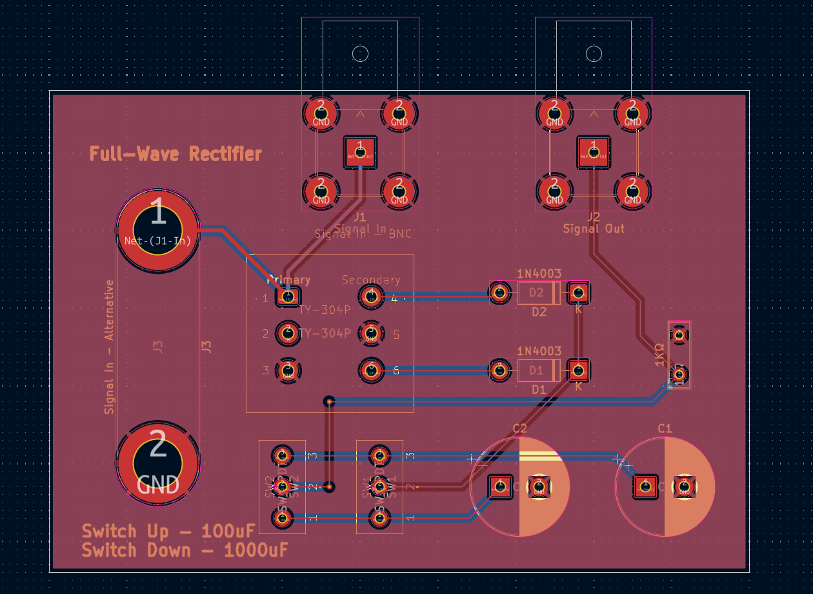

# Full-Wave Rectifier KiCAD Project

This repository contains the KiCAD project files for a full-wave rectifier circuit. The circuit is designed to convert an AC input to a DC output and features a switchable filter capacitance to demonstrate the effect of different capacitor values on the rectified signal.

## Features

- **Full-Wave Rectification**: Utilizes a bridge rectifier configuration to convert the full AC waveform into a DC signal.
- **Switchable Capacitance**: A slide switch allows for toggling between a 100uF and a 1000uF filter capacitor. This is useful for demonstrating how capacitance value affects the ripple voltage of the DC output.
- **BNC Connectors**: The board uses BNC connectors for both AC input and DC output, making it easy to connect to standard lab equipment like function generators and oscilloscopes.
- **Clear Silkscreen Labels**: The PCB is labeled to indicate the function of the switch and the input/output connectors.

## Project Files

- **[Rectifier_AC_to_DC.kicad_pro](Rectifier_AC_to_DC.kicad_pro)**: The main KiCAD project file.
- **[Rectifier_AC_to_DC.kicad_sch](Rectifier_AC_to_DC.kicad_sch)**: The circuit schematic.
- **[Rectifier_AC_to_DC.kicad_pcb](Rectifier_AC_to_DC.kicad_pcb)**: The PCB layout file.
- **[PCB_Layout.png](PCB_Layout.png)**: A rendered image of the PCB layout.

## Circuit Overview

The circuit takes an AC signal, passes it through a transformer (`TR1`), and then rectifies it using a full-wave bridge rectifier (diodes `D1`, `D2`, `D3`, `D4`). The rectified DC signal is then smoothed by a filter capacitor (`C1` or `C2`). A switch (`SW1`) allows the user to select either the 100uF capacitor (`C1`) or the 1000uF capacitor (`C2`) to see the difference in filtering. The output is available at a BNC connector (`J2`).

## Usage

1.  Provide an AC input signal to the "Signal In" BNC connector (`J1`).
2.  Use the slide switch (`SW1`) to select the desired filter capacitance:
    -   **Up Position**: 100uF (`C1`)
    -   **Down Position**: 1000uF (`C2`)
3.  Observe the smoothed DC output from the "Signal Out" BNC connector (`J2`).

## PCB Layout

## License

This project is licensed under the [LICENSE](LICENSE) file.